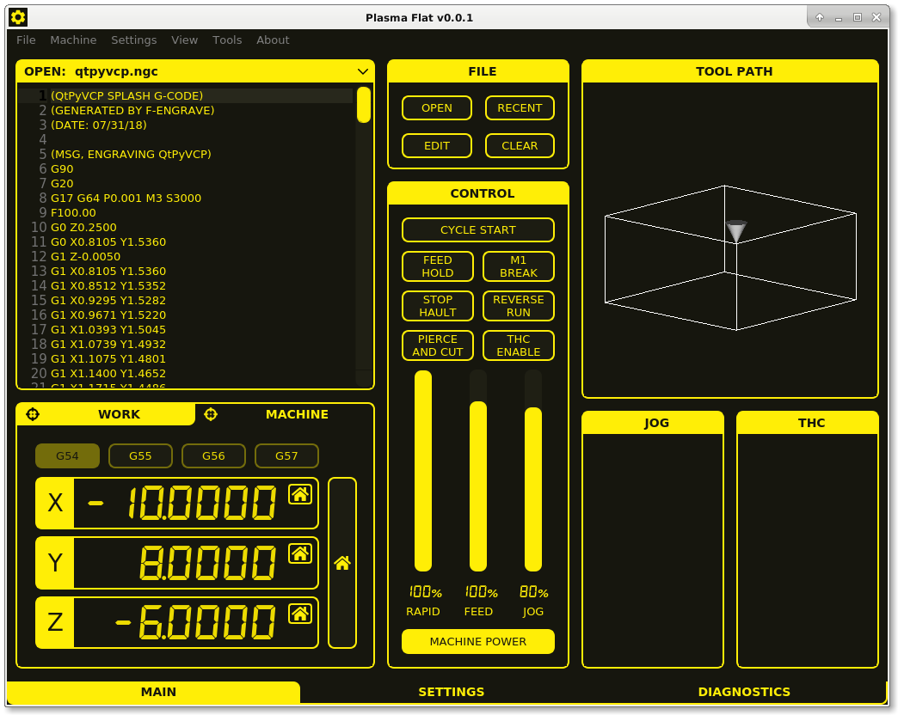

# MonoKrom Virtual Control Panel

Monochrome style VCPs for LinuxCNC controlled Lathes, Mills and Plasma cutters.

## Installation

If you have not already done so, install the [QtPyVCP software dependencies](http://www.qtpyvcp.com/install/prerequisites.html#software-dependencies)

Install QtPyVCP

`pip install qtpyvcp`

Install MonoKrom (includes lathe, mill and plasma VCPs)

`pip install git+https://github.com/kurtjacobson/monokrom-vcp`

To install the MonoKrom LinuxCNC sim configs run 

`monokrom --install-sim`

## Acknowledgements

Designed by: [@pinder](https://forum.linuxcnc.org/cb-profile/pinder)  
Forum Thread: [forum.linuxcnc.org/qtpyvcp/40082](https://forum.linuxcnc.org/qtpyvcp/40082)
